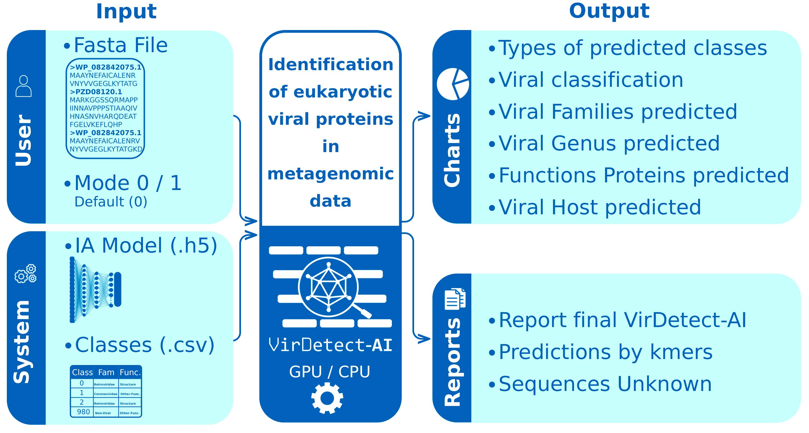

<!-- <em> <h1 align="center"> VirDetect-AI </h1></em> -->
<p align="center">
   <!---->
   <!--  -->
   
</p>

This repository contains a Deep Learning model for identifying partial virus protein sequences in metagenomic data.
In this repository are available the necessary data and the environment to run the query application.

Download Extra suplementary data of VirDetect-AI
[https://zenodo.org/doi/10.5281/zenodo.13328820 ](https://zenodo.org/doi/10.5281/zenodo.13328820)

   <p align="left">
   
   </p>


 [](https://github.com/alyzart22/VirDetect-AI/watchers)
[](https://github.com/alyzart22/VirDetect-AI/stargazers)
[](https://github.com/VirDetect-AI/VirDetect-AI/commits)

<!-- Motodology of VirDetect-AI 

  -->
 # Motodology of VirDetect-AI
 <p align="left">
   
</p>

<!-- Model Deep Learning architecture
# Architecture of Model Deep Learning
   -->


<!-- Api consult VirDetect-AI
# Api consult VirDetect-AI
  -->
# Api consult VirDetect-AI
 <p align="left">
   
</p>

<!-- Options-->
# There are two options to test the VirDetect-AI tool, through a google colab notebook or locally by installing a predefined environment
<!-- Execute notebook -->
## Option 1 - Execute Notebook
1.- Download the notebook Notebook_api_VirDetect-AI.ipynb located in the Notebook_VirDetect-AI folder in this repository.

2.- Execute the notebook Notebook_api_VirDetect-AI.ipynb on Google colab (GPU)  or jupiter. Remember that the allowed format is only Fasta and the output is generated and saved in the outputs folder, which is a temporary folder in google drive [content], remember to download your results.

<!-- INSTALL API -->
## Option 2 -Install API consult


1. Clone the repository to local (or download manually all repository)
   ```sh
   git clone https://github.com/alyzart22/VirDetect-AI.git
   
   ```
2.- Download from this link the model and colocate inside the folder API_VirDetect-AI
   ```sh
https://drive.google.com/file/d/1jVLshzOz3bOPWuIbaoNSAV4yRl4JBAOD/view?usp=sharing
   ```

### If you have GPU Nvidia GTX or RTX _*Drivers Nvidia should be updated_

2. Create enviroment
   ```sh
   conda env create --file ./API_VirDetect-AI/enviroments/virdetect-ai_gpu.yml 
   ```
   Activate you enviroment
   ```sh
   conda activate virdetect-ai_gpu 
   ```
   Execute this line in console 
   ```sh
   export LD_LIBRARY_PATH=$LD_LIBRARY_PATH:$CONDA_PREFIX/lib/ 
   ```
   
   Execute this line to check that the gpu is working 
   ```sh
   python -c "import tensorflow as tf; print(tf.config.list_physical_devices('GPU'))"
   ```
   Output expected example: `[PhysicalDevice(name='/physical_device:GPU:0', device_type='GPU')]`

### If you don´t have GPU
2. Create enviroment
   ```sh
   conda env create --file ./VirDetect-AI/enviroments/virdetect-ai_cpu.yml 
   ```
   Activate you enviroment
   ```sh
   conda activate virdetect-ai_cpu 
   ```

### Download model VirDetect-AI
3. Download the VirDetect-AI model.h5 from the following link and place it inside the /API_VirDetect-AI/ folder.
[Link to download model.h5](https://drive.google.com/file/d/1tu_BJ9hxy0I89cF-4E4hsJvkZYDGpL3N/view?usp=sharing)

### Execute API consult VirDetect-AI
4. In this section you can try with you own metagenomics data
   In this line, you can replace the `hepadna.fasta` file with your own FASTA file. The command accepts **3 arguments**:

1. **`hepadna.fasta`** – the query containing the amino acid sequences.  
2. **`40`** – the *kmer_stride* (recommended range: 20–60).  
3. **`0`** – the execution mode:  
   - **Mode 0 (default):** Allows input sequences **≥ 300 amino acids**.  
   - **Mode 1:** Allows input sequences **> 255 amino acids**.

Remember to run this command while you are **inside** the `/VirDetect-AI/API_VirDetect-AI/` directory.

   ```python
   python ./api_virdetect-ai.py ./hepadna.fasta 40 0
   ```

### Output Api consult VirDetect-AI
 5. The output are the following 6 pie graphs and 3 files csv, report with the predictions by kmers, prediction by sequences and sequences unknown.
<p align="left">
   
</p>

<!-- REFERENCE -->
# Reference and citation
If you use VirDetect-AI plese cite this paper:
Alida Zárate, Lorena Díaz-González, Blanca Taboada, VirDetect-AI: a residual and convolutional neural network–based metagenomic tool for eukaryotic viral protein identification, Briefings in Bioinformatics, Volume 26, Issue 1, January 2025, bbaf001, [https://doi.org/10.1093/bib/bbaf001](https://doi.org/10.1093/bib/bbaf001)


<!-- CONTACT -->
# Contact

Ali Zárate - alida.zarate@ibt.unam.mx

Project Link: [https://github.com/alyzart22/VirDetect-AI](https://github.com/alyzart22/VirDetect-AI)

# Authors


 [](https://www.researchgate.net/profile/Alida-Zarate)
 [](https://www.researchgate.net/profile/Blanca-Taboada)
 [](https://www.researchgate.net/profile/Lorena-Diaz-Gonzalez) 
 #### Alida Zárate |  Blanca Taboada  | Lorena Díaz  
